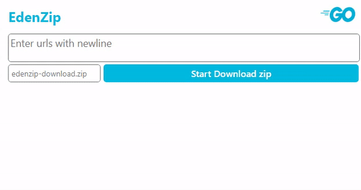

# eden-zip
 online superfast zipper



## Logic

1. Client request with urls `string` and filename `string`
   1. Split `\r\n` urls `string` to urls `[]string`
   2. Call the `zipper.Zipper()` method
2. Download urls overall and write zip file
   1. Make random string value using `uriuri` and define the path
   2. Download files and append filenames using go-routines
      - Download and append only with StatusOK response
      - call the `downloadFile()` with channel
   3. Write zip using two `sync.WaitGroup` and channel
      1. open files and declare `os.File` to channel
      2. call the `writeZip()` with path, files, outFilename
      3. Delete all downloaded files
      4. Return path
3. Return file attachment to client

## Dependencies

```
github.com/labstack/echo v3.3.10+incompatible
github.com/labstack/gommon v0.3.0 // indirect
golang.org/x/crypto v0.0.0-20201221181555-eec23a3978ad // indirect
```

and (uriuri by dchest)[https://github.com/dchest/uniuri]